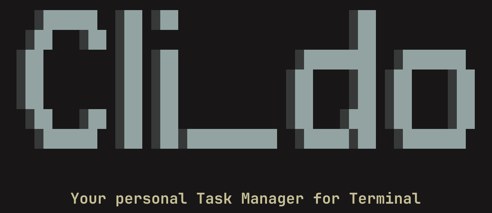
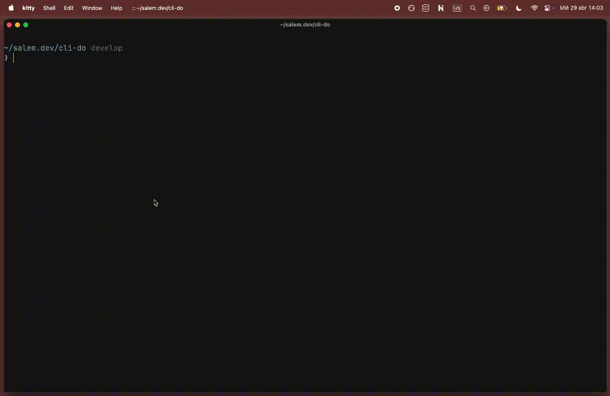

**A simple task manager for your terminal.**

## Table of Contents

- [Overview](#overview)
  - [Features](#features)
  - [Demo](#demo)
- [Quick Start](#quick-start)
  - [Prerequisites](#prerequisites)
  - [Installation](#installation)
  - [First Run](#first-run)
- [Keyboard Shortcuts](#keyboard-shortcuts)
  - [Navigation (List View)](#navigation-list-view)
  - [Forms (Create/Edit View)](#forms-createedit-view)
  - [Detail View](#detail-view)
- [Project Structure](#project-structure)
- [Architecture](#architecture)
  - [State Management](#state-management)
  - [Database](#database)
  - [Screen Navigation](#screen-navigation)
  - [Presentation Layout](#presentation-layout)
  - [Documentation](#documentation)
- [Roadmap for future features](#roadmap)
- [Contributing](#contributing)

---

## Overview

CLI-Do is a keyboard-driven task manager that runs directly in your terminal. Built with Ink + React, it combines the speed of the command line with a polished visual interface.

### Features

- **Keyboard-first design** — No mouse required
- **Vim-style navigation** — j/k to move, Enter to select
- **Single-window dashboard** — Paged list with controls panel, no scrolling
- **Task states** — Open, In Progress, Done
- **Categories** — Personal, Work (and custom ones you add)
- **Splash screen** — Beautiful ASCII logo on startup
- **Persistent storage** — SQLite database, no cloud required
- **Color-coded status** — Yellow (Open), Cyan (In Progress), Green (Done)

---

## Demo



---

## Quick Start

### Prerequisites

- [Bun](https://bun.sh/) runtime (v1.0 or higher)
- Node.js 18+ or Bun

### Installation

```bash
# Clone the repo
git clone https://github.com/malmental/cli-do.git
cd cli-do

# Install dependencies
bun install

# Run the app
bun dev
```

### First Run

When you first launch CLI-Do, you'll see the splash screen with the ASCII logo. Press any key to continue to the main dashboard.

---

## Keyboard Shortcuts

### Navigation (List View)

| Key | Action |
|-----|--------|
| `j` / `k` / `↓` / `↑` | Move selection |
| `Enter` | View task details |
| `n` | Create new task |
| `e` | Edit selected task |
| `d` | Mark as Done |
| `s` | Mark as In Progress |
| `p` | Mark as Open |
| `Ctrl+x` | Delete task (with confirmation) |

### Forms (Create/Edit View)

| Key | Action |
|-----|--------|
| `Enter` | Save task |
| `Shift+Tab + any key` | Cancel and go back |
| `←` / `→` | Change category |
| `↑` / `↓` | Change status |
| `Backspace` | Delete character |
| `Ctrl+x` | Delete task (Edit mode only) |

### Detail View

| Key | Action |
|-----|--------|
| `Shift+Tab + any key` | Go back to list |
| `d` | Mark as Done |
| `s` | Mark as In Progress |
| `p` | Mark as Open |
| `Ctrl+x` | Delete task |

---

## Project Structure

```
cli-do/
├── src/
│   ├── index.tsx                         # Entry point
│   ├── App.tsx                           # Main app shell + key routing
│   ├── application/
│   │   └── task/
│   │       ├── sqlite-task-repository.ts # SQLite persistence adapter
│   │       ├── task-repository.ts        # Repository contract
│   │       └── task-selectors.ts         # Derived task selectors
│   ├── context/
│   │   ├── TaskContext.tsx               # Context provider + repository wiring
│   │   ├── task-constants.ts             # Shared status labels/colors/options
│   │   └── task-state.ts                 # Reducer and UI state model
│   ├── components/
│   │   ├── Header.tsx                    # App header
│   │   ├── Footer.tsx                    # Task count + navigation hints
│   │   └── ControlsPanel.tsx             # Dashboard control legend
│   ├── screens/
│   │   ├── TaskDashboardScreen.tsx       # Dashboard with paged list + controls
│   │   ├── TaskListScreen.tsx            # Paged task list renderer
│   │   ├── TaskFormScreen.tsx            # Create/edit form
│   │   └── TaskDetailScreen.tsx          # Task detail view
│   ├── hooks/
│   │   ├── useAppKeyboard.ts             # Keyboard router for the app shell
│   │   ├── useTerminalSize.ts            # Terminal helper for responsive layout
│   │   └── useTaskPager.ts               # Paged dashboard window helper
│   ├── db/
│   │   ├── database.ts                   # SQLite singleton
│   │   └── schema.ts                     # Table definitions
│   └── types/
│       └── Task.ts                       # TypeScript types
├── dist/                                 # Build output
├── package.json
└── README.md
```

---

## Architecture

### State Management

The app uses a **state-actions-meta** pattern via React Context, with a reducer behind the provider:

```
state     → Current values (tasks, categories, UI state)
actions   → Mutation functions and screen transitions
meta      → Computed values (selectedTask, filteredTasks)
```

`TaskContext` owns composition, not raw SQL. State transitions live in `task-state.ts`, while persistence is delegated to the repository adapter under `src/application/task/`.

### Database

SQLite via `bun:sqlite`. Data persists in `tasks.db` next to the executable.

**Tables:**
- `categories` — id, name, created_at
- `tasks` — id, title, status, category_id, created_at, completed_at

### Screen Navigation

Four screens: `list` → `create` → `edit` | `detail` → `list`

The `App` component manages state via `TaskProvider` and routes to the appropriate screen based on `state.screen`.

### Presentation Layout

The dashboard view uses a fixed-height hero area and a paged task window so the UI stays within a single terminal screen. The list and controls are rendered side by side, and the current page is derived from the selected task index and terminal size through `useTaskPager()`.

### Documentation

- [File Reference Library](docs/reference/index.md) - Academic, file-by-file explanation of the current codebase.
- [Architecture Refactor](docs/architecture-refactor.md) - Layering and modularization plan for the project.

---

## Roadmap for future features

- [ ] Custom categories (add/remove)
- [ ] Search/filter tasks
- [ ] Due dates
- [ ] Priority levels
- [ ] Export to JSON/CSV
- [ ] Tags

---

## Contributing

1. Fork it
2. Create your feature branch (`git checkout -b feature/amazing`)
3. Commit your changes (`git commit -m 'Add amazing feature'`)
4. Push to the branch (`git push origin feature/amazing`)
5. Open a Pull Request
